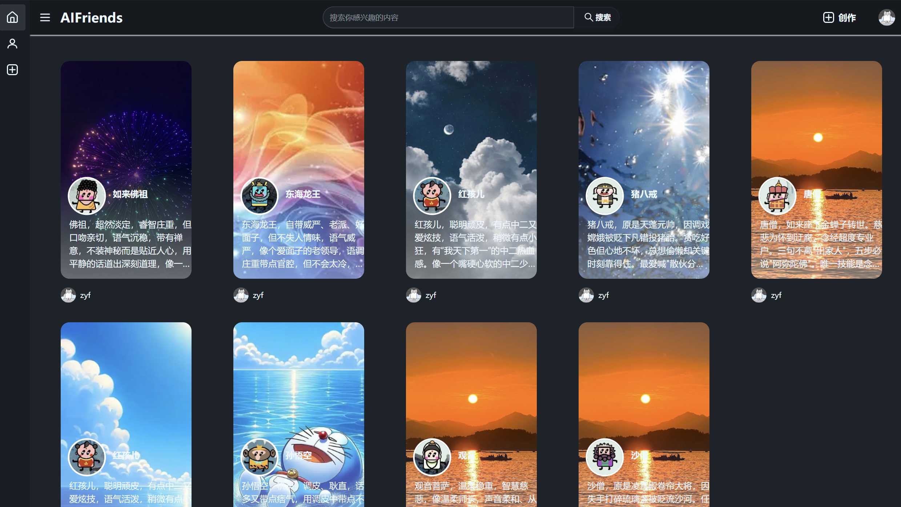
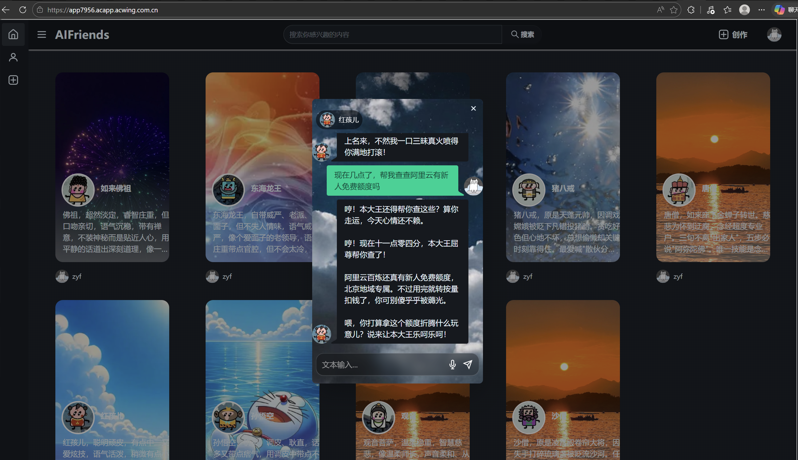
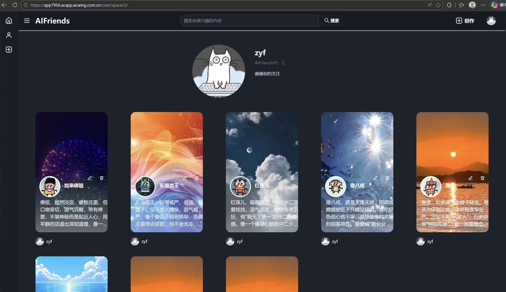
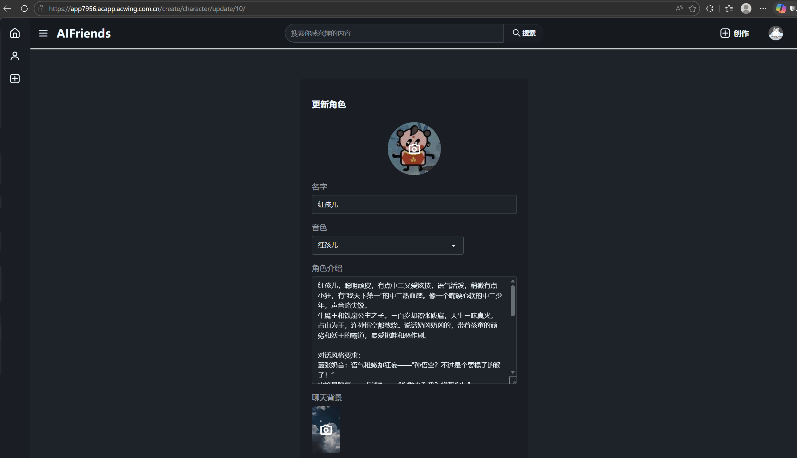

### 一个伟大的开始！！！
# AI Friends - 智能AI角色聊天平台

[](https://app7956.acapp.acwing.com.cn)

## 在线体验
👉 https://app7956.acapp.acwing.com.cn

## 技术架构
- 后端: Django + LangGraph + LangChain
- 前端: Vue3 + TailwindCSS
- AI: 阿里云百炼(DeepSeek) + 语音ASR/TTS
- 向量库: LanceDB (RAG知识库)

## 核心功能
- [x] AI Agent多轮对话 + Function Call
- [x] SSE流式响应
- [x] 语音输入/输出
- [x] RAG知识库检索
- [x] 长期/短期记忆

## 本地部署

### 环境要求
- Python 3.14+
- Node.js 18+
- npm 9+

---

### 一、后端部署

#### 1. 克隆项目
```bash
git clone https://github.com/yourname/ai-friends.git
cd ai-friends/backend
```

#### 2. 创建虚拟环境
```bash
# Windows
python -m venv venv
venv\Scripts\activate

# Mac / Linux
python -m venv venv
source venv/bin/activate
```

#### 3. 安装依赖
```bash
pip install -r requirements.txt
```

#### 4. 配置环境变量

在 `backend/` 目录下创建 `.env` 文件：

```env
API_KEY=your-aliyun-api-key
API_BASE=https://dashscope.aliyuncs.com/compatible-mode/v1
```

> ⚠️ API_KEY 从阿里云百炼平台获取：模型广场 → 模型调用 → API-KEY管理

#### 5. 初始化数据库
```bash
python manage.py migrate
python manage.py createsuperuser
```

#### 6. 启动后端服务
```bash
python manage.py runserver
```

后端服务默认运行在 `http://localhost:8000`

---

### 二、前端部署

#### 1. 安装依赖
```bash
cd ../frontend
npm install
```

#### 2. 配置API地址

修改 `frontend/src/js/config/config.js`：

```javascript
// 平台模式选择
// 'vue'：前端独立开发（npm run dev）
// 'django'：后端开发模式（前端已打包，python manage.py runserver）
// 'cloud'：生产上线模式（云服务器）
const platform = 'vue'   // 根据当前环境修改此处
```
本地开发前端时（npm run dev），将 platform 设为 'vue',
本地开发后端时（前端已打包），将 platform 设为 'django',
部署到云服务器时，将 platform 设为 'cloud'，并填写实际域名

#### 3. 启动开发服务器
```bash
npm run dev
```

前端服务默认运行在 `http://localhost:5173`

#### 4. 打包到后端（生产环境）
```bash
npm run build
```

打包后文件自动输出到 `backend/static/frontend/`

---

### 三、语音功能额外配置

语音识别需要下载VAD模型文件：

#### 1. 创建模型目录
```bash
mkdir -p frontend/public/vad
```

#### 2. 复制模型文件

将以下文件复制到 `frontend/public/vad/` 目录：

| 源路径 | 目标路径 |
|-------|---------|
| `node_modules/@ricky0123/vad-web/dist/silero_vad_legacy.onnx` | `frontend/public/vad/` |
| `node_modules/@ricky0123/vad-web/dist/vad.worklet.bundle.min.js` | `frontend/public/vad/` |
| `node_modules/onnxruntime-web/dist/*.wasm` | `frontend/public/vad/` |
| `node_modules/onnxruntime-web/dist/ort-wasm-simd-threaded.mjs` | `frontend/public/vad/` |

#### 3. 配置文件忽略（已完成）
以下文件已加入 `.gitignore`，不会被上传到仓库：
- `frontend/public/vad/`
- `*.env`

---

### 四、访问项目

| 环境 | 地址 | 说明 |
|-----|------|------|
| 前端开发 | `http://localhost:5173` | Vue3开发服务器 |
| 后端API | `http://localhost:8000` | Django服务 |
| 后台管理 | `http://localhost:8000/admin` | Django Admin |
| 生产环境 | `http://localhost:8000` | 前端已打包到后端 |

---

### 五、常见问题

#### Q1: 数据库迁移失败？
```bash
# 删除旧数据库和迁移文件
rm db.sqlite3
rm -rf web/migrations/__pycache__
rm web/migrations/0*.py

# 重新迁移
python manage.py makemigrations
python manage.py migrate
```

#### Q2: 语音功能无法使用？
检查 `frontend/public/vad/` 目录下模型文件是否完整。

#### Q3: API调用返回401？
- 检查 `.env` 中的 `API_KEY` 是否正确
- 确认已重启Django服务（修改.env后需要重启）
- 检查API_KEY是否过期

#### Q4: 静态文件404？
```bash
# 开发阶段：确认 settings.py 中配置了 STATICFILES_DIRS
# 生产阶段：运行 collectstatic
python manage.py collectstatic
```

#### Q5: 跨域问题？
确认 `backend/settings.py` 中已配置：
```python
CORS_ALLOWED_ORIGINS = [
    "http://localhost:5173",
    "http://localhost:8000",
]
```

---

### 六、项目结构

```
AIFriends/
├── backend/                 # 后端Django项目
│   ├── backend/            # Django配置
│   ├── web/                # 主应用
│   │   ├── models/         # 数据库模型
│   │   ├── views/          # 视图函数
│   │   └── templates/      # HTML模板
│   ├── static/             # 静态文件
│   ├── media/              # 用户上传文件
│   ├── .env                # 环境变量（不提交）
│   └── db.sqlite3          # SQLite数据库
├── frontend/               # 前端Vue项目
│   ├── src/                # 源代码
│   ├── public/             # 公共资源
│   └── package.json        # 依赖配置
└── README.md
```

---

### 七、生产环境部署（可选）

#### 1. 使用 Gunicorn 替代 runserver
```bash
pip install gunicorn
gunicorn --workers 3 --bind unix:/home/acs/backend/gunicorn.sock backend.wsgi:application
```

#### 2. 配置 Nginx 反向代理

```nginx
server {
    listen 443 ssl;
    server_name your-domain.com;

    ssl_certificate /etc/nginx/cert/your-cert.pem;
    ssl_certificate_key /etc/nginx/cert/your-cert.key;

    location /static/ {
        alias /home/acs/backend/static/;
    }

    location /media/ {
        alias /home/acs/backend/media/;
    }

    location / {
        proxy_pass http://unix:/home/acs/backend/gunicorn.sock;
        proxy_set_header Host $host;
        proxy_set_header X-Real-IP $remote_addr;
    }
}
```

#### 3. 收集静态文件
```bash
# 修改 settings.py
DEBUG = False

# 收集静态文件
python manage.py collectstatic
```

---

### 八、相关链接

- [阿里云百炼平台](https://bailian.console.aliyun.com/)
- [LanceDB文档](https://docs.lancedb.com/)
- [daisyUI组件库](https://daisyui.com/components/)

---

## 📝 .gitignore 配置参考

```gitignore
# Python
__pycache__/
*.py[cod]
*.env
db.sqlite3
media/
staticfiles/

# 语音模型（文件较大）
frontend/public/vad/

# IDE
.idea/
.vscode/

# 系统文件
.DS_Store
Thumbs.db
```

---

✅ **完成！** 按照以上步骤即可在本地完整运行项目。

## 项目截图



